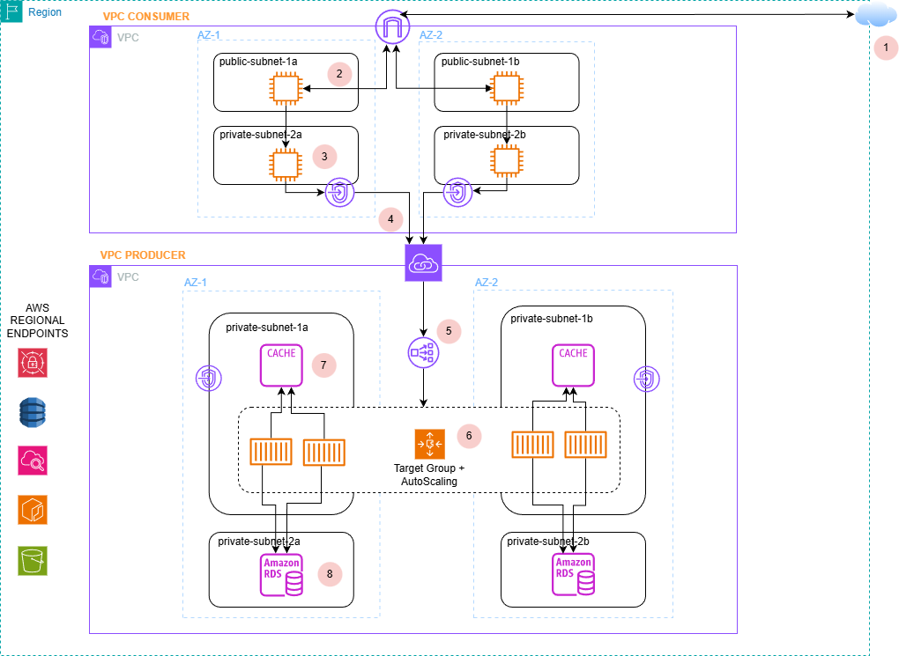

# Arquitectura Multi-VPC privada con AWS PrivateLink

Arquitectura con dos VPCs que se comunican de forma privada usando AWS PrivateLink, ECS Fargate, NLB y RDS PostgreSQL, junto con un clúster de Redis como caché.

## 1. Diagrama de la arquitectura

## 2. Componentes
- VPC consumidora
- VPC productora
- Instancias EC2
- Internet Gateway
- PrivateLink
- VPC endpoints
- Network Load Balancer
- RDS PostgreSQL
- Caché
- Contenedores ECS Fargate

Todo en un backend 100% privado inaccesible de forma pública.

## 3. Flujo en la red

1. Un  cliente dentro de la VPC del consumer (desde la instancia EC2, por ejemplo) resuelve un DNS privado del Interface Endpoint.
2. El tráfico va a la ENI del Interface Endpoint (IP privada).
3. PrivateLink dirige el tráfico al Endpoint Service de la VPC Productora.
4. El tráfico llega al NLB, que distribuye a Target Group con las tareas ECS.
5. ECS llama a Redis y RDS según sea necesario.
6. Una vez el código en ECS responde, la respuesta sigue el camino inverso.

## 4. Principios de seguridad

1. El NLB es interno, con lo cual no puede ser accesible desde Internet
2. Los datos solo son accesibles desde ECS, es decir, no se puede acceder a RDS ni a caché de ninguna forma que no sea a través de los contenedores ECS
3. RDS está configurado con la opción "Access public" desactivada.
4. El Endpoint Service de la VPC Productora requiere aprobación manual, es decir, que el encargado de la VPC productora decide si acepta o no acepta que otra VPC pueda consumir sus servicios.
5. Ningún contenedor tiene IP pública. El tráfico solo llega desde el Network Load Balancer.

## 5. Decisiones de diseño

Todas las decisiones de diseño importantes que he tomado se encuentran documentadas en la carpeta `architecture-decisions/`:

- [Architecture Design](architecture-decisions/architecture-design.md)
- [Why PrivateLink](architecture-decisions/privatelink.md)
- [NAT vs VPC Endpoints](architecture-decisions/nat-vs-vpc-endpoints.md)

## 6. Código

El código de la API utilizada en esta arquitectura se encuentra en el siguiente repositorio:

🔗 [API - Node.js + Express + ECS Deployment](https://github.com/alainmartinez23/api-productos.git)

La API forma parte de esta arquitectura multi-VPC y fue desplegada en ECS Fargate como backend privado accesible únicamente mediante AWS PrivateLink.

## 7. Posibles mejoras
- Añadir observabilidad sería seguramente lo más importante. Todo tipo de métricas que ayudaran a mirar tanto la salud como la eficiencia del sistema.
- Implementar AutoScaling basado en métricas (de ahí la importancia del punto anterior).
- Añadir rate limiting si lo consideráramos oportuno. Esta arquitectura está pensada para que equipos de la misma organización trabajen entre ellos y no debería hacer falta, pero se podría tener en cuenta si hay un cambio de planes.
- Utilizar un sistema de autenticación más complejo en lugar de usar API keys.